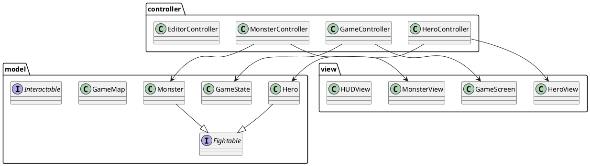

# Documentation Technique - BeyondTime

## Architecture Logicielle

### Pattern MVC

Le projet suit le pattern MVC (Modèle-Vue-Contrôleur) :

#### Modèle
- `model/entities/` : Classes des entités du jeu (Hero, Monster, Items...)
- `model/map/` : Gestion de la carte et des tuiles
- `model/game/` : État du jeu et logique métier
- `model/config/` : Configuration du jeu
- `model/interfaces/` : Interfaces définissant les comportements

#### Vue
- `view/screens/` : Écrans du jeu (Menu, Jeu, Éditeur, Pause, Victory, GameOver...)
- `view/components/` : Composants réutilisables (HUD, Map...)
- `view/entities/` : Représentation visuelle des entités
- `view/effects/` : Effets visuels (DamagePopup, animations...)

#### Contrôleur
- `controller/game/` : Gestion du jeu et de la boucle principale
- `controller/editor/` : Gestion de l'éditeur de niveaux
- `controller/input/` : Gestion des entrées utilisateur
- `controller/entities/` : Contrôleurs spécifiques aux entités (Hero, Monster...)

### Diagramme de Classes

## Composants Principaux

### Système de Jeu
- Gestion des collisions dans `HeroController` avec détection précise par cellule
- Système de combat avec attaques au corps à corps
- Système de stamina pour le sprint
- Gestion des items et inventaire avec 5 slots
- Système d'invincibilité temporaire après les dégâts
- Effets de statut (poison, ralentissement)
- Système de victoire et game over

### Système de Monstres
- Spawn dynamique des monstres
- IA de poursuite du joueur
- Système de dégâts et de mort
- Respawn après un délai aléatoire
- Affichage des dégâts infligés

### Éditeur de Niveaux
- Interface graphique intuitive
- Types de tuiles variés :
  - Normal : Traversable
  - Obstacle : Bloquant
  - Ralentissement : Réduit la vitesse
  - Poison : Inflige des dégâts
  - Spawner : Point d'apparition des monstres
  - Exit : Point de sortie du niveau
  - Start : Point de départ du héros
- Sauvegarde/chargement de cartes
- Système d'annulation (Undo)
- Gestion des assets visuels

### Système de Sauvegarde
- Sauvegarde complète de l'état du jeu
- Format personnalisé avec sérialisation
- Gestion des chemins relatifs pour les assets
- Horodatage des sauvegardes

### Internationalisation
- Support multilingue via `TranslationManager`
- Fichiers de ressources pour EN/FR
- Interface utilisateur adaptative

### Configuration
- Gestion des paramètres via `GameConfig`
- Options de résolution d'écran
- Persistance des préférences
- Configuration des contrôles

## Patterns de Conception Utilisés

1. **Singleton**
   - `GameConfig`
   - `TranslationManager`
   - `SaveGameManager`

2. **Observer**
   - Mise à jour de l'interface utilisateur
   - Gestion des événements de jeu
   - Système de callbacks pour les mises à jour

3. **Factory**
   - Création des entités
   - Génération des niveaux
   - Création des effets visuels

4. **Strategy**
   - Comportements des entités
   - Types de tuiles
   - Gestion des collisions

5. **State**
   - États du jeu (Menu, En jeu, Pause, Game Over)
   - États des entités (Vivant, Mort, Invincible)

## Gestion des Ressources

### Assets
- Images stockées dans `resources/`
- Système de chargement asynchrone
- Gestion des erreurs de chargement
- Cache des images pour les performances

### Persistance
- Sauvegarde des niveaux en format personnalisé
- Configuration en JSON
- Gestion des erreurs de lecture/écriture

## Performance et Optimisation

### Rendu
- Utilisation efficace du système de scènes JavaFX
- Gestion optimisée de la caméra
- Limitation du nombre d'objets affichés

### Collision
- Système de grille pour les collisions
- Optimisation des calculs de distance
- Hitboxes simplifiées

### Mémoire
- Gestion des ressources avec nettoyage automatique
- Réutilisation des objets graphiques
- Limitation des allocations dynamiques

## Tests et Qualité

### Tests Unitaires
- JUnit pour les tests
- Couverture des composants critiques
- Tests des collisions et du gameplay

### Logging
- Système de logging pour le débogage
- Gestion des erreurs avec stacktrace
- Logs de performance

## Évolutivité

Le code est conçu pour faciliter l'ajout de :
- Nouveaux types d'entités
- Nouvelles époques/niveaux
- Nouveaux comportements d'IA
- Nouvelles langues 
- Nouveaux effets visuels
- Nouveaux types de tuiles 