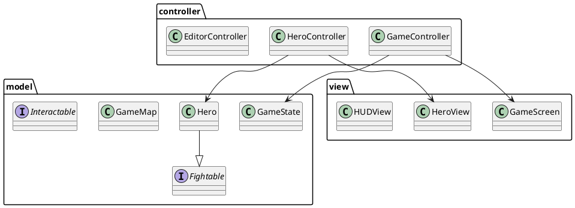

# Documentation Technique - BeyondTime

## Architecture Logicielle

### Pattern MVC

Le projet suit le pattern MVC (Modèle-Vue-Contrôleur) :

#### Modèle
- `model/entities/` : Classes des entités du jeu (Hero, Boss, Items...)
- `model/map/` : Gestion de la carte et des tuiles
- `model/game/` : État du jeu et logique métier
- `model/config/` : Configuration du jeu
- `model/interfaces/` : Interfaces définissant les comportements

#### Vue
- `view/screens/` : Écrans du jeu (Menu, Jeu, Éditeur...)
- `view/components/` : Composants réutilisables (HUD, Map...)
- `view/entities/` : Représentation visuelle des entités

#### Contrôleur
- `controller/game/` : Gestion du jeu
- `controller/editor/` : Gestion de l'éditeur
- `controller/input/` : Gestion des entrées utilisateur

### Diagramme de Classes

## Composants Principaux

### Système de Jeu
- Gestion des collisions dans `HeroController`
- Système de combat via l'interface `Fightable`
- Gestion des items et inventaire

### Éditeur de Niveaux
- Interface graphique intuitive
- Sauvegarde/chargement de cartes
- Gestion des propriétés des tuiles

### Internationalisation
- Support multilingue via `TranslationManager`
- Fichiers de ressources pour EN/FR

### Configuration
- Gestion des paramètres via `GameConfig`
- Persistance des préférences

## Patterns de Conception Utilisés

1. **Singleton**
   - `GameConfig`
   - `TranslationManager`

2. **Observer**
   - Mise à jour de l'interface utilisateur
   - Gestion des événements

3. **Factory**
   - Création des entités
   - Génération des niveaux

4. **Strategy**
   - Comportements des entités
   - Types de tuiles

## Gestion des Ressources

### Assets
- Images stockées dans `resources/`
- Système de chargement asynchrone
- Gestion des erreurs de chargement

### Persistance
- Sauvegarde des niveaux en format personnalisé
- Configuration en JSON

## Tests et Qualité

### Tests Unitaires
- JUnit pour les tests
- Couverture des composants critiques

### Logging
- Système de logging pour le débogage
- Gestion des erreurs

## Évolutivité

Le code est conçu pour faciliter l'ajout de :
- Nouveaux types d'entités
- Nouvelles époques/niveaux
- Nouveaux comportements
- Nouvelles langues 